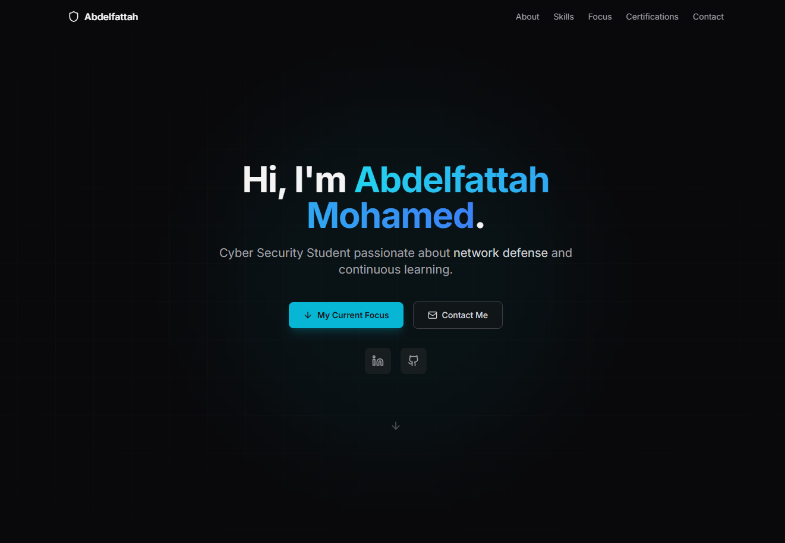

# 🌐 My Portfolio Website

---

## 🖼️ Homepage Preview

👉 **Live Demo:** [https://abdelfattah-mohamed-portfolio.vercel.app/](https://abdelfattah-mohamed-portfolio.vercel.app/)

---

## 📌 Overview

This repository contains the source code for my **personal portfolio website**. 
It highlights my **skills, focus areas, and professional journey** in:

* **Cyber Security**
* **Network Defense**
* **Continuous Learning**

---

## 🛠️ Technologies Used

* **Frontend:** React.js, TypeScript
* **Styling:** Tailwind CSS
* **Build Tool:** Vite
* **Deployment:** Vercel
